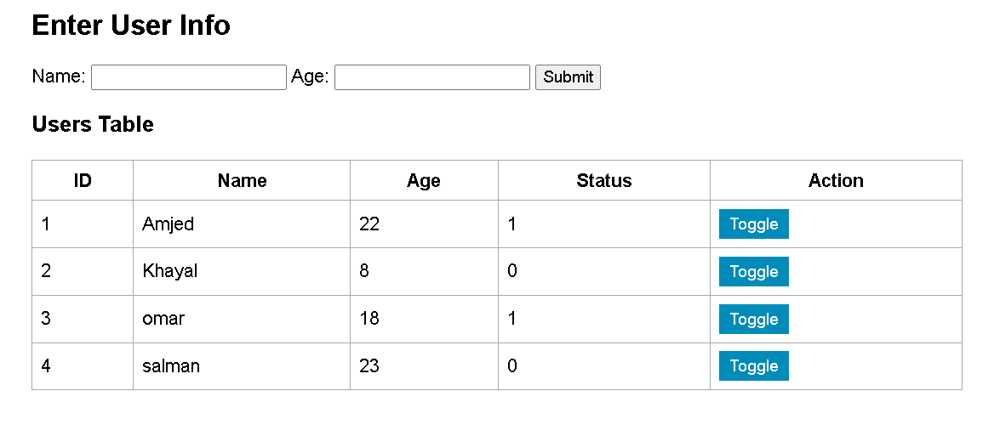

# User Status Web Application

This is a simple web application built using **HTML**, **CSS**, **JavaScript**, **PHP**, and **MySQL**. It allows users to input their **name** and **age**, stores the data into a MySQL database, displays all user records in a table, and includes a **toggle** feature to switch each user's status between 0 and 1 dynamically.

---

##  Project Screenshot

Below is a screenshot after submitting users and toggling their status:




---

##  Features

- Add new users by entering name and age.
- Store users in MySQL database.
- Display all users in a table.
- Toggle status (0 or 1) for each user without page reload.
- Fully responsive and styled with custom CSS.

---

##  Technologies Used

- **Frontend**: HTML, CSS, JavaScript
- **Backend**: PHP
- **Database**: MySQL (via phpMyAdmin)
- **Local Server**: XAMPP (Apache & MySQL)

---

##  How It Works

1. **Form Submission**: User enters their name and age, then clicks "Submit".
2. **Insert to DB**: `insert.php` handles inserting the user into the MySQL table.
3. **Display Table**: `index.php` fetches all users and displays them in a table.
4. **Toggle Button**: Each row has a "Toggle" button that uses AJAX to call `toggle.php` to flip the status between 0 and 1.

---

##  Setup Instructions (Using XAMPP)

### 1. Start Services in XAMPP
- Run **Apache** and **MySQL**

### 2. Create Database
- Visit: `http://localhost/phpmyadmin`
- Create a database called: `user_status`
- Run this SQL to create the table:

```sql
CREATE TABLE users (
    id INT(11) AUTO_INCREMENT PRIMARY KEY,
    name VARCHAR(100),
    age INT(3),
    status TINYINT(1) DEFAULT 0
);
```

### 3. Place Project in XAMPP
- Copy the project folder `user_form` to:  
  `C:/xampp/htdocs/`

### 4. Open in Browser
- Go to:  
  `http://localhost/user_form/index.php`

---

##  Project Structure

```
user_form/
├── index.php
├── insert.php
├── toggle.php
├── script.js
├── style.css
```

---

##  Notes

- You must have XAMPP installed and running properly.
- This is a beginner-friendly full-stack project using raw PHP and JS.
- Screenshot must be added to reflect form after submission.

---

##  Screenshot Sample

This is what the database looks like from the inside:


---

##  Author

Developed by **Amjad** as part of Smart Methods Web Development Task.
